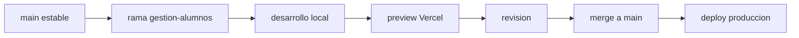

# Operacion y desarrollo seguro

Este documento define como avanzar sin botar la pagina publica.

## Flujo recomendado

## Reglas de trabajo

- `main` debe quedar siempre estable.
- Las funciones nuevas se desarrollan en una rama separada.
- No se despliega a produccion hasta probar en preview.
- La landing debe seguir funcionando aunque el sistema privado este incompleto.
- Toda tabla nueva debe tener documentacion.
- Toda ruta privada debe tener control de acceso.

## Checklist antes de publicar

- La home carga bien.
- El menu funciona.
- Los formularios funcionan.
- El admin actual sigue funcionando.
- No hay errores visibles en consola.
- No hay datos privados visibles desde la landing.
- Las variables de entorno existen en Vercel.
- Supabase no muestra errores de permisos.

## Versiones de avance

### Version 0.1

- Documentacion inicial.
- Esquema de datos propuesto.
- No afecta la landing.

### Version 0.2

- Base de autenticacion por roles.
- Rutas privadas protegidas.
- Dashboard minimo.

### Version 0.3

- Gestion de alumnos y coaches.
- Asignacion coach-alumno.

### Version 0.4

- Rutinas y ejercicios.
- Videos enlazados.

### Version 0.5

- Registro de resultados.
- Historial de progreso.

### Version 0.6

- Datos medicos con consentimiento.
- Reportes y graficos.

