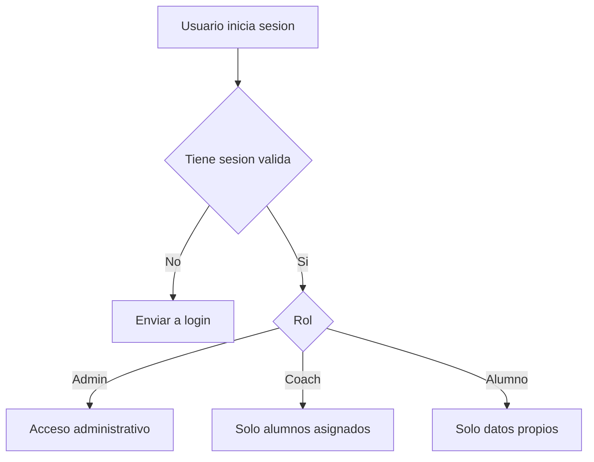

# Seguridad y privacidad

Este proyecto va a manejar dos tipos de informacion:

- Contenido publico de la landing.
- Datos privados de alumnos, coaches y progreso deportivo.

Los datos medicos o restricciones fisicas son datos sensibles y requieren mayor cuidado.

## Reglas base

- No guardar claves secretas en el repositorio.
- Usar variables de entorno en Vercel.
- Mantener el repositorio privado.
- Usar roles claros: admin, coach, alumno.
- Guardar roles de acceso en datos controlados por el sistema, no en campos editables por alumnos.
- Activar Row Level Security en Supabase.
- Registrar consentimiento antes de guardar datos medicos.
- Evitar borrar alumnos con historial; mejor desactivar.

## Repositorio

Si el repositorio es publico:

- Cualquier persona puede ver el codigo.
- Cualquier persona puede copiarlo o hacer fork.
- No pueden modificar tu repo directamente sin permiso.
- Si hubo claves expuestas, hay que rotarlas aunque el repo pase a privado.

Recomendacion:

- Pasar el repo a privado antes de avanzar con el sistema de gestion.
- Revisar que no existan claves reales en commits antiguos.
- Rotar claves si alguna vez se pegaron en archivos o mensajes publicos.

## Supabase

Variables que nunca deben ir en el navegador:

- `SUPABASE_SECRET_KEY`
- Service role key.
- Claves privadas de cualquier proveedor.

Variables que pueden existir en cliente solo si se usan con RLS correcto:

- Supabase public anon key.
- URL publica del proyecto.

## Datos medicos

Antes de guardar datos medicos, se recomienda:

- Mostrar consentimiento claro al alumno.
- Explicar para que se usaran los datos.
- Permitir solicitar eliminacion o correccion.
- Limitar acceso a admin y coach autorizado.
- Separar datos medicos en tabla propia.
- Registrar solo informacion necesaria para entrenar de forma segura.

## Buenas practicas de acceso

## Backups y recuperacion

- Activar backups en Supabase Pro.
- Exportar esquema SQL antes de cambios grandes.
- No ejecutar migraciones directamente en produccion sin probar.
- Mantener preview de Vercel para pruebas.
