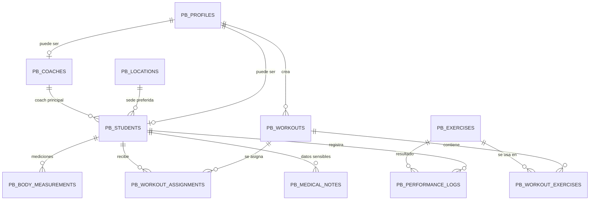

# Modelo de datos - Sistema de gestion

Este documento describe la base de datos propuesta para el sistema privado de Pulpo Box.

## Vision general



## Tablas principales

### `pb_profiles`

Perfil base de usuario conectado a Supabase Auth.

Campos importantes:

- `id`: identificador del usuario.
- `role`: `admin`, `coach` o `student`.
- `full_name`.
- `email`.
- `phone`.
- `is_active`.

### `pb_students`

Informacion especifica del alumno.

Campos importantes:

- `profile_id`.
- `location_id`.
- `primary_coach_id`.
- `height_cm`.
- `current_weight_kg`.
- `goal`.
- `emergency_contact_name`.
- `emergency_contact_phone`.
- `medical_consent_at`.

### `pb_coaches`

Informacion especifica de coach.

Campos importantes:

- `profile_id`.
- `bio`.
- `specialty`.
- `photo_url`.

### `pb_workouts`

Rutinas creadas por admin o coach.

Campos importantes:

- `title`.
- `summary`.
- `workout_date`.
- `created_by`.
- `level`.
- `notes`.

### `pb_exercises`

Catalogo de ejercicios.

Campos importantes:

- `name`.
- `description`.
- `video_url`.
- `movement_type`.

### `pb_workout_exercises`

Relacion entre rutina y ejercicios.

Campos importantes:

- `workout_id`.
- `exercise_id`.
- `position`.
- `prescription`.
- `sets`.
- `reps`.
- `time_cap_seconds`.

### `pb_workout_assignments`

Asignacion de rutina a alumnos.

Campos importantes:

- `workout_id`.
- `student_id`.
- `assigned_by`.
- `status`.

### `pb_performance_logs`

Resultados registrados por el alumno o coach.

Campos importantes:

- `student_id`.
- `exercise_id`.
- `workout_id`.
- `weight_kg`.
- `reps`.
- `rounds`.
- `time_seconds`.
- `score_text`.
- `student_notes`.
- `coach_notes`.

### `pb_body_measurements`

Seguimiento fisico.

Campos importantes:

- `student_id`.
- `measured_at`.
- `body_weight_kg`.
- `height_cm`.
- `waist_cm`.
- `notes`.

### `pb_medical_notes`

Datos sensibles. Deben estar protegidos con permisos estrictos.

Campos importantes:

- `student_id`.
- `note_type`.
- `description`.
- `visible_to_coach`.
- `created_by`.

## Reglas de permisos esperadas

```text
Admin
- Puede ver y editar todo.

Coach
- Puede ver alumnos asignados.
- Puede ver resultados de alumnos asignados.
- Puede crear rutinas.
- Puede ver datos medicos solo si existe permiso.

Alumno
- Puede ver su propio perfil.
- Puede ver sus rutinas asignadas.
- Puede crear sus resultados.
- No puede ver informacion de otros alumnos.
```

## Datos sensibles

Los datos medicos no deben mezclarse con contenido publico ni con tablas editables desde la landing. Deben quedar separados, con reglas de acceso y consentimiento.

