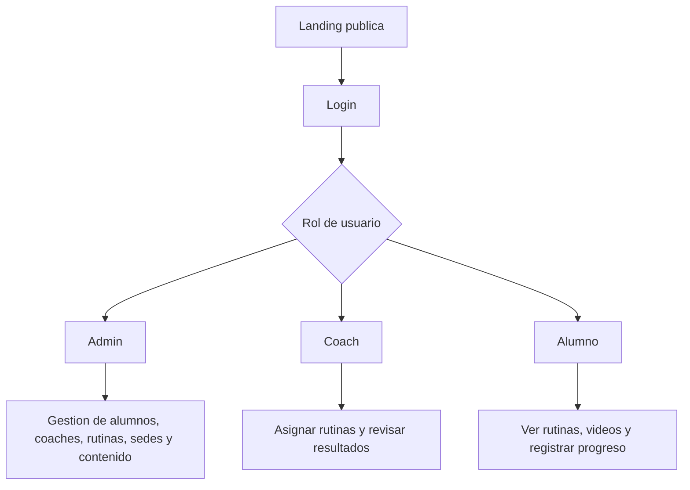

# Plan de trabajo - Sistema de gestion Pulpo Box

Este documento define la ruta para transformar la landing actual en una plataforma privada de gestion para administradores, coaches y alumnos, sin interrumpir la pagina publica.

## Objetivo

Mantener la pagina publica funcionando como canal comercial y agregar un sistema privado donde cada usuario vea solo lo que corresponde.



## Principios del proyecto

- La landing actual no se reemplaza ni se rompe.
- Todo desarrollo nuevo se hace en rama separada y preview de Vercel.
- Produccion solo se actualiza cuando una etapa esta revisada.
- Los datos sensibles se guardan con permisos por rol.
- Los videos se alojan en un servicio preparado para streaming; Supabase guarda metadatos y enlaces.

## Roles

### Admin

- Gestiona alumnos.
- Gestiona coaches.
- Gestiona sedes.
- Crea y edita rutinas.
- Revisa progreso general.
- Mantiene contenido visible de la landing.

### Coach

- Ve alumnos asignados.
- Crea rutinas y ejercicios.
- Agrega videos o enlaces.
- Revisa pesos, tiempos, repeticiones y notas.
- Hace seguimiento individual.

### Alumno

- Ve sus rutinas.
- Revisa videos y descripciones.
- Registra resultados.
- Consulta historial y progreso.
- Actualiza datos basicos permitidos.

## Etapas recomendadas

### Etapa 0 - Seguridad y base

Estado: en preparacion.

- Mantener repositorio privado.
- Confirmar variables de entorno.
- Documentar arquitectura.
- Crear esquema inicial de base de datos.
- Definir permisos por rol.

### Etapa 1 - Login por rol

Estado: base inicial creada.

- Mantener login administrador actual.
- Preparar login extendido para coaches y alumnos.
- Crear rutas privadas:
  - `/admin`
  - `/coach`
  - `/alumno`
- Redirigir segun rol.
- Bloquear rutas privadas sin sesion.

Primera implementacion:

- `/login.html`: entrada central al sistema.
- `/dashboard.html`: panel privado protegido.
- `/admin.html`: panel clasico de contenido, se mantiene disponible.
- Rol activo inicial: `admin`.
- Login extendido: usuarios creados en Supabase Auth pueden entrar si tienen perfil activo en `pb_profiles`.
- Rol `student`: redirige a `/student.html` para ver rutinas asignadas y registrar resultados propios.
- Rol `coach`: redirige a `/coach.html` para ver alumnos asignados y ultimas marcas.

### Etapa 2 - Alumnos y coaches

Estado: modulo inicial de alumnos en desarrollo.

- Crear alumnos.
- Editar alumnos.
- Desactivar alumnos sin borrar historial.
- Crear coaches.
- Asignar coach principal a cada alumno.
- Ver ficha del alumno.

Primera implementacion de alumnos:

- `/students.html`: pantalla privada para admin.
- `/api/admin/students`: API para listar, crear y activar/desactivar alumnos.
- `/coaches-admin.html`: pantalla privada para crear coaches.
- `/api/admin/coaches`: API para listar, crear y activar/desactivar coaches.
- `/coach.html`: primera vista privada de coach.
- `/api/coach/overview`: API protegida por rol coach.
- La pantalla avisa si falta ejecutar el esquema de Supabase.

### Etapa 3 - Rutinas

Estado: modulo inicial de rutinas en desarrollo.

- Crear rutinas por dia o semana.
- Agregar ejercicios.
- Agregar descripcion escrita.
- Agregar enlace de video.
- Asignar rutina a uno o varios alumnos.

Primera implementacion:

- `/workouts.html`: pantalla privada para crear rutinas simples.
- `/api/admin/workouts`: API para listar y crear rutinas con ejercicio base.
- `/api/admin/exercises`: API para exponer la biblioteca base de ejercicios.
- `data/exercise-library.js`: biblioteca generada desde `Glosario.xlsx` con 342 ejercicios en 4 secciones: Ejercicios, Progresiones, Movilidad y Core.
- `/exercises.html`: pantalla privada para agregar y desactivar ejercicios personalizados.
- Permite asignacion inicial a un alumno si ya existe en la base.
- El creador de rutinas puede seleccionar ejercicios desde el glosario o escribir uno manualmente.
- El creador de rutinas ya permite agregar varios ejercicios ordenados en una misma rutina.

### Etapa 4 - Registro de resultados

Estado: modulo inicial de resultados en desarrollo.

- Registrar peso usado.
- Registrar repeticiones.
- Registrar tiempo.
- Registrar rondas.
- Registrar notas del alumno.
- Registrar feedback del coach.

Primera implementacion:

- `/results.html`: pantalla privada para registrar resultados.
- `/api/admin/results`: API para listar y guardar marcas de entrenamiento.
- `/student.html`: permite al alumno registrar sus propios resultados.
- `/api/student/overview`: API protegida por rol alumno.
- Conecta alumno, rutina y ejercicio cuando esos datos existen.
- El alumno registra resultados sobre ejercicios reales de sus rutinas asignadas.
- El coach ya puede revisar las ultimas marcas de sus alumnos asignados y guardar feedback tecnico desde su panel.

### Etapa 5 - Progreso

Estado: modulo inicial de progreso en desarrollo.

- Historial por ejercicio.
- Grafico de progreso.
- Peso corporal.
- Estatura.
- Medidas opcionales.
- Marcas personales.

Primera implementacion:

- `/progress.html`: pantalla privada de seguimiento por alumno.
- `/api/admin/progress`: API para consultar historial y registrar mediciones corporales.
- Resume peso, estatura, cintura y cantidad de marcas recientes.

### Etapa 6 - Datos medicos

Estado: modulo inicial de datos medicos en desarrollo.

- Lesiones.
- Restricciones.
- Medicamentos relevantes si el alumno acepta informarlo.
- Contacto de emergencia.
- Consentimiento de tratamiento de datos sensibles.

Primera implementacion:

- `/medical.html`: pantalla privada solo para admin.
- `/api/admin/medical`: API para listar y crear notas sensibles.
- Requiere confirmacion explicita de consentimiento antes de guardar.

### Etapa 7 - Mejoras futuras

- Pagos.
- Asistencia.
- Notificaciones por WhatsApp.
- Reportes mensuales.
- App movil si el flujo lo justifica.

## Rutas propuestas

```text
/                 Landing publica
/login            Entrada privada
/admin            Panel administrador
/admin/alumnos    Gestion de alumnos
/admin/coaches    Gestion de coaches
/admin/rutinas    Gestion de rutinas
/coach            Panel coach
/coach/alumnos    Alumnos asignados
/coach/rutinas    Rutinas creadas
/alumno           Panel alumno
/alumno/rutina    Rutina actual
/alumno/progreso  Historial y mediciones
```

## Regla de oro para avanzar

Cada etapa debe cumplir esto antes de pasar a la siguiente:

- No rompe la landing.
- Funciona en preview.
- Tiene permisos correctos.
- Esta documentada.
- Se puede revertir sin perder datos.
