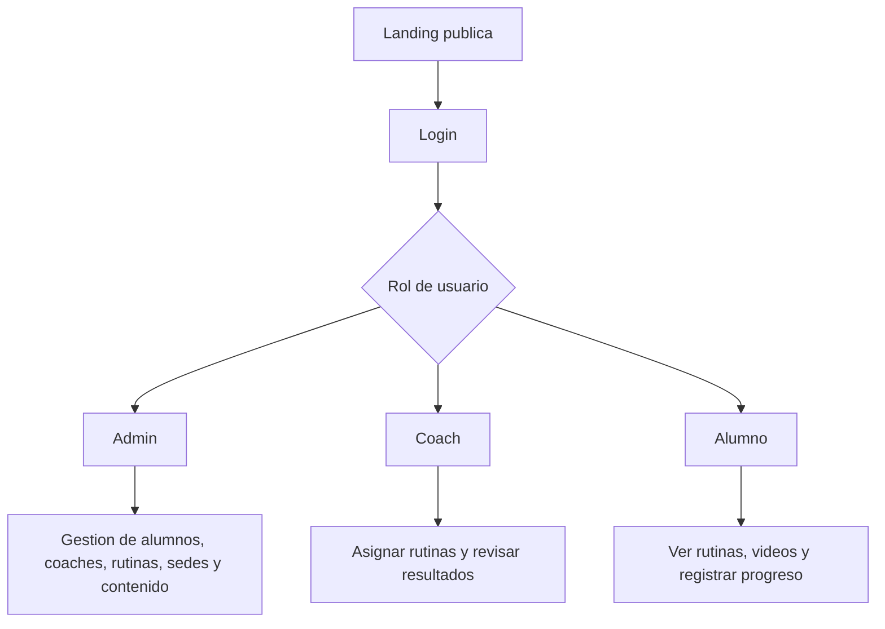

# Plan de trabajo - Sistema de gestion Pulpo Box

Este documento define la ruta para transformar la landing actual en una plataforma privada de gestion para administradores, coaches y alumnos, sin interrumpir la pagina publica.

## Objetivo

Mantener la pagina publica funcionando como canal comercial y agregar un sistema privado donde cada usuario vea solo lo que corresponde.



## Principios del proyecto

- La landing actual no se reemplaza ni se rompe.
- Todo desarrollo nuevo se hace en rama separada y preview de Vercel.
- Produccion solo se actualiza cuando una etapa esta revisada.
- Los datos sensibles se guardan con permisos por rol.
- Los videos se alojan en un servicio preparado para streaming; Supabase guarda metadatos y enlaces.

## Roles

### Admin

- Gestiona alumnos.
- Gestiona coaches.
- Gestiona sedes.
- Crea, edita y elimina rutinas.
- Revisa progreso general.
- Mantiene contenido visible de la landing.

### Coach

- Ve alumnos asignados.
- Crea, edita y elimina sus propias rutinas y ejercicios.
- Agrega videos o enlaces.
- Revisa pesos, tiempos, repeticiones y notas.
- Hace seguimiento individual.

### Alumno

- Ve sus rutinas.
- Revisa videos y descripciones.
- Registra resultados.
- Consulta historial y progreso.
- Actualiza datos basicos permitidos.

## Etapas recomendadas

### Etapa 0 - Seguridad y base

Estado: en preparacion.

- Mantener repositorio privado.
- Confirmar variables de entorno.
- Documentar arquitectura.
- Crear esquema inicial de base de datos.
- Definir permisos por rol.

### Etapa 1 - Login por rol

Estado: base inicial creada.

- Mantener login administrador actual.
- Preparar login extendido para coaches y alumnos.
- Crear rutas privadas:
  - `/admin`
  - `/coach`
  - `/alumno`
- Redirigir segun rol.
- Bloquear rutas privadas sin sesion.

Primera implementacion:

- `/login.html`: entrada central al sistema.
- `/dashboard.html`: panel privado protegido.
- `/change-password.html`: vista privada para que coach y alumno actualicen su propia clave cuando ya tienen sesion activa.
- `/admin.html`: panel clasico de contenido, se mantiene disponible.
- Rol activo inicial: `admin`.
- Login extendido: usuarios creados en Supabase Auth pueden entrar si tienen perfil activo en `pb_profiles`.
- El login extendido ya fue validado de punta a punta para coach y alumno usando credenciales reales creadas desde el panel admin.
- Rol `student`: redirige a `/student.html` para ver rutinas asignadas y registrar resultados propios.
- Rol `coach`: redirige a `/coach.html` para ver alumnos asignados y ultimas marcas.
- Admin ya puede regenerar claves temporales para alumnos y coaches desde sus listados si olvidan el acceso.

### Etapa 2 - Alumnos y coaches

Estado: modulo inicial de alumnos en desarrollo.

- Crear alumnos.
- Editar alumnos.
- Desactivar alumnos sin borrar historial.
- Crear coaches.
- Asignar coach principal a cada alumno.
- Ver ficha del alumno.

Primera implementacion de alumnos:

- `/students.html`: pantalla privada para admin.
- `/api/admin/students`: API para listar, crear y activar/desactivar alumnos.
- `/api/admin/access-reset`: API protegida por rol admin para regenerar claves temporales de alumnos y coaches.
- `/student-detail.html`: ficha privada de admin para editar datos base del alumno y abrir sus modulos operativos con contexto.
- `/api/admin/student-detail`: API protegida por rol admin para cargar y actualizar la ficha del alumno.
- `/coaches-admin.html`: pantalla privada para crear coaches.
- `/api/admin/coaches`: API para listar, crear y activar/desactivar coaches.
- `/locations-admin.html`: pantalla privada para crear, editar y activar/desactivar sedes.
- `/api/admin/locations`: API protegida por rol admin para listar y mantener sedes operativas.
- `/coach-detail.html`: ficha privada de admin para editar datos base del coach y revisar su contexto operativo.
- `/api/admin/coach-detail`: API protegida por rol admin para cargar y actualizar la ficha del coach.
- `/coach.html`: primera vista privada de coach.
- `/api/coach/overview`: API protegida por rol coach.
- `/coach-student.html`: ficha detallada para seguimiento individual desde coach.
- `/api/coach/student-detail`: API protegida por rol coach para ver rutinas, mediciones, marcas y notas visibles de sus alumnos asignados.
- La ficha del coach ya muestra descripcion, enfoque y enlaces de video dentro de los ejercicios asignados al alumno.
- La ficha del coach ya filtra el historial por rutina y ejercicio, y entrega lectura rapida de tendencia sobre el filtro activo.
- Admin ya puede entrar a una ficha unificada por coach desde el listado y revisar alumnos asignados, rutinas creadas y ultimas marcas relacionadas.
- Admin ya puede entrar a una ficha unificada por alumno desde el listado y mantener el mismo `student_id` al abrir progreso, resultados o datos medicos.
- Admin ya puede crear, editar y desactivar sedes, y usarlas desde el alta inicial de alumnos.
- La ficha admin del alumno ya incluye acceso rapido al modulo de rutinas manteniendo el mismo contexto de alumno.
- La pantalla avisa si falta ejecutar el esquema de Supabase.

### Etapa 3 - Rutinas

Estado: modulo inicial de rutinas en desarrollo.

- Crear rutinas por dia o semana.
- Agregar ejercicios.
- Agregar descripcion escrita.
- Agregar enlace de video.
- Asignar rutina a uno o varios alumnos.

Primera implementacion:

- `/workouts.html`: pantalla privada para crear rutinas simples.
- `/api/admin/workouts`: API para listar y crear rutinas con ejercicio base.
- `/api/admin/exercises`: API para exponer la biblioteca base de ejercicios.
- `data/exercise-library.js`: biblioteca generada desde `Glosario.xlsx` con 342 ejercicios en 4 secciones: Ejercicios, Progresiones, Movilidad y Core.
- `/exercises.html`: pantalla privada para agregar y desactivar ejercicios personalizados.
- Permite asignacion inicial a un alumno si ya existe en la base.
- El creador de rutinas puede seleccionar ejercicios desde el glosario o escribir uno manualmente.
- El creador de rutinas ya permite agregar varios ejercicios ordenados en una misma rutina.
- El creador de rutinas ahora tiene una primera experiencia inspirada en TeamBuild: bloques de sesion, orden manual, tempo, descanso y una vista previa guiada de la rutina antes de guardarla.
- Admin ya puede reasignar rutinas existentes a multiples alumnos activos y quitar asignaciones desde el mismo modulo.
- Admin ya puede editar y eliminar rutinas completas desde el mismo modulo.
- `/coach-workouts.html`: pantalla privada para que el coach cree rutinas y las asigne solo a sus alumnos activos.
- `/api/coach/workouts`: API protegida por rol coach para listar rutinas relacionadas, cargar biblioteca y crear nuevas rutinas.
- El coach ya puede reasignar o quitar alumnos dentro de rutinas creadas por su propio perfil, manteniendo solo lectura sobre rutinas externas.
- El coach ya puede editar y eliminar rutinas creadas por su propio perfil, manteniendo solo lectura sobre rutinas externas.
- La experiencia guiada usa `workout-flow.js` para mantener compatibilidad con el esquema actual mientras guarda bloque, tempo y descanso dentro de la prescripcion extendida.

### Etapa 4 - Registro de resultados

Estado: modulo inicial de resultados en desarrollo.

- Registrar peso usado.
- Registrar repeticiones.
- Registrar tiempo.
- Registrar rondas.
- Registrar notas del alumno.
- Registrar feedback del coach.

Primera implementacion:

- `/results.html`: pantalla privada para registrar resultados.
- `/api/admin/results`: API para listar y guardar marcas de entrenamiento.
- Admin ya puede editar y eliminar resultados desde el mismo modulo.
- El modulo admin de resultados ya pagina el historial por pagina y cantidad de filas configurable para soportar mejor el crecimiento del volumen operativo.
- Admin ya puede editar y eliminar mediciones corporales desde `/progress.html`.
- `/student.html`: permite al alumno registrar sus propios resultados.
- `/api/student/overview`: API protegida por rol alumno.
- `/api/auth/change-password`: API protegida para que coach y alumno cambien su propia clave mientras mantienen sesion activa.
- Conecta alumno, rutina y ejercicio cuando esos datos existen.
- El modulo admin ya acepta `student_id` en URL para entrar filtrado desde la ficha del alumno.
- El alumno registra resultados sobre ejercicios reales de sus rutinas asignadas.
- El alumno ya puede actualizar su telefono y contacto de emergencia desde su propio portal, manteniendo coach, sede y objetivo como datos administrados por el equipo.
- El portal alumno ya filtra historial por rutina y ejercicio, resume tendencia y muestra feedback del coach dentro de sus registros.
- El portal alumno ya muestra descripcion, enfoque y enlaces de video en los ejercicios asignados, incluyendo una vista previa contextual al registrar una marca.
- El portal alumno ya consume la rutina en formato guiado paso a paso, con navegacion entre ejercicios y accion rapida para usar el ejercicio activo en el registro de marcas.
- El portal alumno ya se presenta como una experiencia tipo app con modulos internos de Rutina, Progreso, Salud y Perfil para uso mas claro desde celular.
- El portal alumno ya puede cambiar el estado de una rutina asignada entre pendiente, completada u omitida.
- Coach y admin ya ven ese mismo estado reflejado en sus paneles operativos.
- El coach ya puede revisar las ultimas marcas de sus alumnos asignados y guardar feedback tecnico desde su panel.
- El portal coach ahora se presenta como una experiencia tipo app con modulos internos de Alumnos, Seguimiento, Feedback y Perfil para uso mas claro desde celular o escritorio.
- La ficha del coach ya usa el mismo formato guiado para revisar la rutina activa del alumno sin perder el contexto de seguimiento.
- La ficha individual `coach-student` ahora se presenta en modulos de Perfil, Rutina, Progreso y Salud para ordenar mejor la lectura operativa del alumno.

### Etapa 5 - Progreso

Estado: modulo inicial de progreso en desarrollo.

- Historial por ejercicio.
- Grafico de progreso.
- Peso corporal.
- Estatura.
- Medidas opcionales.
- Marcas personales.

Primera implementacion:

- `/progress.html`: pantalla privada de seguimiento por alumno.
- `/api/admin/progress`: API para consultar historial y registrar mediciones corporales.
- Resume peso, estatura, cintura y cantidad de marcas recientes.
- El modulo ya muestra graficos ligeros de evolucion corporal para peso y cintura.
- El modulo ya muestra graficos ligeros de rendimiento para carga, repeticiones y tiempo, respetando el filtro activo por rutina o ejercicio.
- El modulo admin ya acepta `student_id` en URL para continuidad de flujo desde alumnos.
- El modulo admin de progreso ya filtra historial por rutina y ejercicio, entrega lectura rapida de tendencia y muestra mejores marcas por ejercicio.

### Etapa 6 - Datos medicos

Estado: modulo inicial de datos medicos en desarrollo.

- Lesiones.
- Restricciones.
- Medicamentos relevantes si el alumno acepta informarlo.
- Contacto de emergencia.
- Consentimiento de tratamiento de datos sensibles.

Primera implementacion:

- `/medical.html`: pantalla privada solo para admin.
- `/api/admin/medical`: API para listar y crear notas sensibles.
- Admin ya puede editar y eliminar notas sensibles desde el mismo modulo.
- Requiere confirmacion explicita de consentimiento antes de guardar.
- El modulo admin ya acepta `student_id` en URL y mantiene visibilidad de alumnos inactivos para revision administrativa.
- El modulo admin de datos medicos ya resume consentimiento, contacto de emergencia, filtros por tipo/visibilidad y una vista previa exacta de las notas compartidas con coach.
- El alumno ya puede ver un resumen seguro de su contexto de salud, contacto de emergencia y observaciones medicas registradas por el equipo, incluyendo cuales son visibles para seguimiento del coach.

### Etapa 7 - Mejoras futuras

- Pagos.
- Asistencia.
- Notificaciones por WhatsApp.
- Reportes mensuales.
- App movil si el flujo lo justifica.

## Rutas propuestas

```text
/                 Landing publica
/login            Entrada privada
/admin            Panel administrador
/admin/alumnos    Gestion de alumnos
/admin/coaches    Gestion de coaches
/admin/rutinas    Gestion de rutinas
/coach            Panel coach
/coach/alumnos    Alumnos asignados
/coach/rutinas    Rutinas creadas
/alumno           Panel alumno
/alumno/rutina    Rutina actual
/alumno/progreso  Historial y mediciones
```

## Regla de oro para avanzar

Cada etapa debe cumplir esto antes de pasar a la siguiente:

- No rompe la landing.
- Funciona en preview.
- Tiene permisos correctos.
- Esta documentada.
- Se puede revertir sin perder datos.
